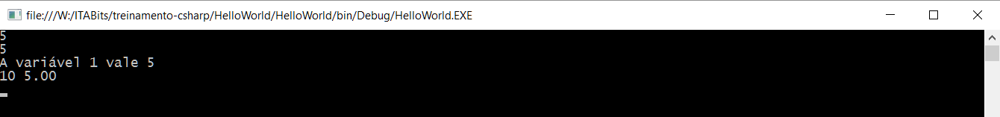

## Indice
* [Tipos](#tipos)
* [Entrada e Saida](#entrada-e-saida)

## Tipos

C# é uma linguagem fortemente tipada. Isso significa que qualquer variavel declarada terá um tipo e não será possivel alterá-lo. Os tipos primitivos de C tem todos equivalentes em C#. Em C# as precisões são bem-definidas, diferente de C, em que estas dependem do compilador. Seguem os tipos já conhecidos:

Tipo | Espaco em Memória | Como declarar em código
-----|-------------------|------------------------
_char_ | 16 bits (Unicode) | _char_ v = 'a';
_int_  | 32 bits           | _int_ v = 1;
_long_ | 64 bits           | _long_ v = 1L;
_float_| 32 bits           | _float_ v = 1.0f
_double_| 64 bits          | _double_ v = 1.0

Note que o char do C# tem 16 bits e usa o padrão Unicode. Nesse padrão, os 256 primeiros caracteres continuam sendo os mesmos do ASCII

Note tambem que a representaçao de numeros reais padrão do C# é o double, sendo necessário colocar o 'f' no final quando se deseja usar variaveis do tipo float. (Lembre-se disso quando estiver usando o Unity, cujo padrão é float).

Todas as operações conhecidas para esses tipos continuam as mesmas.

Além desses, temos novos tipos (que são emprestados do C++):

_bool_: é um tipo booleano, que pode assumir os valores lógicos de _true_ e _false_, em vez de usar 0 e 1.

_string_: que representa uma cadeia infinita de caracteres, com memória alocada dinamicamente). Esse tipo facilita muito por que deixa de lado o uso de um array de _char_'s para strings. Trabalhar com _string_ de C# é muito intuitivo: para concatenar, basta somá-las, com +.  No código _string_ são variaveis declaradas entre "".

## Entrada e Saida

Como foi visto no HelloWorld.cs existe o comando _Console.Write()_ que escreve uma string no console. Existe tambem (que pode ser visto como sugestão ao se escrever o comando anterior) o _Console.WriteLine()_, esse basicamente adiciona um "\n" no final.

Diferentemente do _printf()_, não é necessário dizer qual o tipo de variável quando se quer concatenar na string. Basta colocá-la imediatamente ou somá-la com outra string. Exemplo:

```cs
int variavel1 = 5;
int variavel2 = 10;
Console.WriteLine(variavel1);
Console.WriteLine(5);
Console.WriteLine("A variável 1 vale " + variavel1);
// Ainda é possível aplicar formatação.
Console.WriteLine("{1:g} {0:n}", variavel1, variavel2);
Console.Read();
```

Saída:


Assim, o uso do Console.Write() é mais confortável. Para os casos em que se deseja aplicar a formatação, pode-se usar o estilo de formatação do C#, como feito no ultimo _Console.WriteLine_.

Quanto ao input, existem algumas opções:

```cs
// Análogo a um scanf("%c", &caractere).
// Percebe-se que o Console.Read() precisa ser 'castado' (transformado) em char.
// Para castar uma variável para outro tipo, basta colocar o tipo novo entre parentesis antes da variável.
char c = (char) Console.Read();

// Análogo a um gets(), isto é, lê uma linha até encontrar um "/n"
string str = Console.ReadLine();
```

Para ler algo que não seja um _char_ ou uma _string_ você deve converter deles para outros tipos usando os métodos _Parse_. Exemplos:

```cs
float f = float.Parse(Console.ReadLine());
int i = int.Parse(Console.ReadLine());
// Para ir de qualquer tipo para string basta fazer:
string si = i.ToString();
string sf = f.ToString();
```
